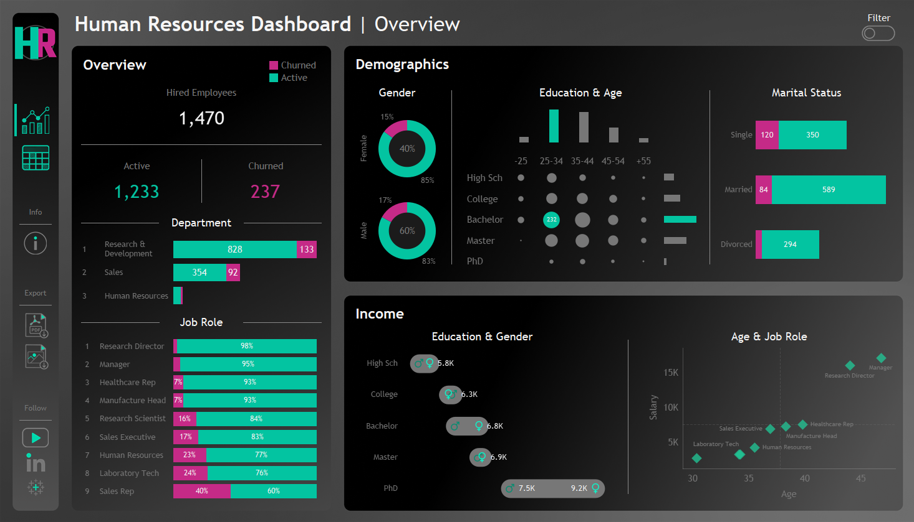
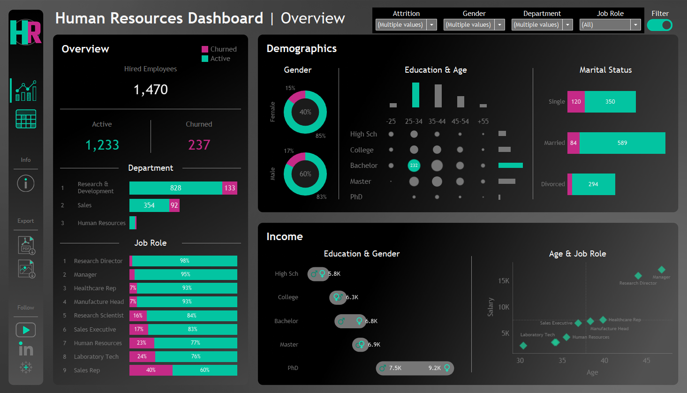

# IBM HR Dashboard 📊

This repository contains an interactive Tableau dashboard built using the **IBM HR Dataset**, offering a comprehensive view of employee demographics, hiring and termination trends, and salary distribution. The dashboard is designed to support data-driven decision-making in workforce management, allowing HR professionals to derive actionable insights for optimizing employee retention and engagement.

## Key Insights and Visualizations

### 1. **Overview**
- **Hired Employees** (KPI Card): Total number of hires over the analyzed period.
- **Active vs. Churned Employees** (KPI Card): A comparison of active and churned employees.
- **Department Distribution** (Bar Chart): Visualizes the distribution of active and churned employees across different departments.
- **Job Role Distribution** (Bar Chart): Shows the percentage of active and churned employees within each job role.

### 2. **Demographics**
- **Gender Distribution** (Pie Chart): Illustrates the gender split between active and churned employees.
- **Education & Age Segmentation** (Heatmap): Displays hired employees segmented by education level and age group to identify trends.
- **Marital Status Analysis** (Bar Chart): Provides insights into the marital status distribution among active and churned employees.

### 3. **Income**
- **Education & Gender Income Comparison** (Barbell Chart): Highlights the average income based on education level, segmented by gender. The barbell chart shows income disparity between genders at each education level.
- **Age & Job Role vs. Salary** (Scatter Plot): Analyzes the relationship between age, job role, and salary to uncover potential patterns or discrepancies.

### Dashboard Features
- **Interactive Filter Button**: A filter button allows users to display all filters, making it easier to refine the data by department, job role, gender, or other criteria. Users can apply multiple filters simultaneously for a more detailed analysis.

### Dashboard Preview
- **Initial Dashboard View**:
  

- **Filters View**:
  

## Tools & Technologies
- **Visualization Tool**: Tableau

## Resources
- [IBM HR Dataset on Kaggle](https://www.kaggle.com/datasets/pavansubhasht/ibm-hr-analytics-attrition-dataset)

## Repository Structure

```bash
ibm-hr-dashboard/
│
├── data/
│   └── ibm_hr_dataset.csv    
│
├── images/
│   ├── dashboard.png     
│   └── dashboard_filters.png
│
├── ibm_hr_dashboard.twbx
└── README.md
